# Tiny Distributed File System
It is a simple distributed file system, implemented using golang, under referrence of GFS(Google File System) and HDFS(Hadoop Distributed File System). It's a curriculum homework  —— distributed system design.

The demenstration of the TDFS is on BiliBili: https://www.bilibili.com/video/av75265326

整个系统的演示视频位于：https://www.bilibili.com/video/av75265326

## Requirements
实现一个分布式系统（而非基于分布式系统的应用），其能提供分布式通信能力；提供分布式并行计算能力；提供分布式缓存能力；提供分布式文件处理能力等。要求编程实现，编程语言不限。整个系统不要求一定全部实现，如果不能实现，详细说明难点和缘由。

## Abstract/Overview
Tiny Distributed File System（以下简称TDFS）是我所设计的分布式系统的名称。其实现了一个简单的分布式文件系统。从功能上讲，TDFS实现了在分布式文件系统中的文件存储、文件读取、文件删除三项最基本的文件操作功能。从架构上讲，TDFS与HDFS/GFS有着类似的Master/Slave架构，TDFS包括客户端Client、名称节点NameNode（以下简称NN）、数据节点DataNode（以下简称DN）三部分构成。从编程实现上讲，我使用Go语言编写了TDFS，并且使用了Go语言中的Gin框架来编写NN、DN服务器的后端。**整个TDFS项目一共有1200余行代码，皆为自主编写。**

## 1 架构设计
### 1.1 基本架构
TDFS使用主从式（Master/Slave）架构。一个集群分为名称节点NN和多个数据节点DN。NN存放了文件目录和TDFS的全部控制信息。而DN存放所有文件的块副本数据及其哈希。客户端通过NN读取相关信息并通过NN与DN交互通信（这一点与HDFS不同）。

其中文件存储实现了分块存储：文件通过客户端发送给名称节点NN，然后NN对文件切分成等大小的文件块，然后把这些块发给特定的DN进行存储。而且还实现了冗余存储（TDFS的默认冗余系数是2）：一个文件块会被发给多个DN进行存储，这样在一份文件块数据失效之后，还有一块备份。冗余存储也是分布式文件系统中标配的。DN上不仅会存储文件块数据，还会存储文件块数据的哈希值（TDFS默认使用sha256哈希函数）。

另外文件读取实现了数据完整性检测。被分布式存储的文件在读取时NN会去相应的DN上进行读取文件块副本数据。然后NN会对返回的文件块副本数据进行校验和（Checksum）检测，即对其数据内容进行哈希计算，然后和存储在DN上的文件哈希进行对比，如果不一致说明数据块已经遭到破坏，此时NN会去其他DN上读取另一个块副本数据。

文件删除就是将本文件所分布在各个DN服务器上的数据块清空。

文件存储、文件读取、文件删除是文件最基础的操作。后续的文件追加（append）、文件覆盖写（write）都可以由这三种操作组合来实现。

### 1.2 存储文件（Put）流程
TDFS的存储文件的流程如下图所示：
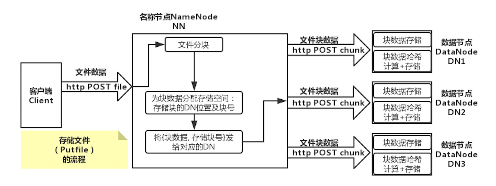

### 1.3 读取文件（Get）流程
TDFS的读取文件的流程如下图所示：
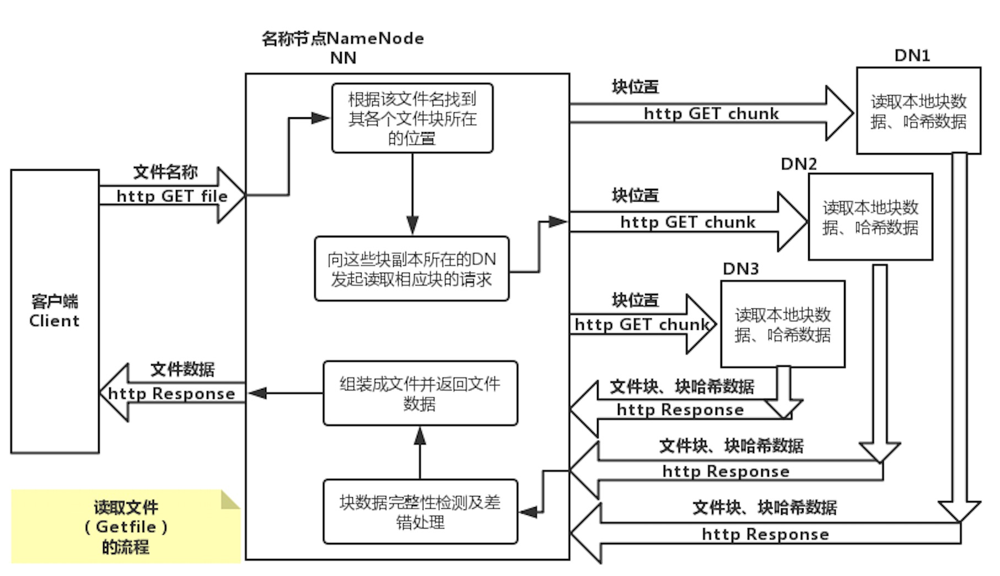

### 1.4 删除文件（Del）流程
TDFS的删除文件的流程如下图所示：
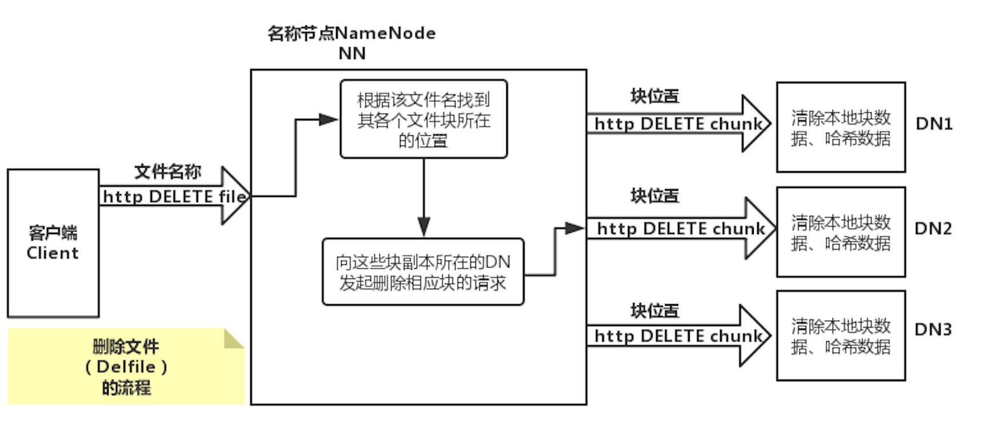

## 2 代码实现
### 2.1 项目结构
在TDFS的项目下所有文件及文件夹如下所示：

```shell
├── Client.go // 调用src/client.go里面的函数来模拟一个TDFS的Client
├── DN1.go		// 调用src/datanode.go里面的函数来启动一个TDFS的DataNode
├── DN2.go		// 调用src/datanode.go里面的函数来启动一个TDFS的DataNode
├── DN3.go		// 调用src/datanode.go里面的函数来启动一个TDFS的DataNode
├── NN.go			// 调用src/namenode.go里面的函数来启动一个TDFS的DataNode
├── DataNode1 // 在本地伪分布式演示时DN1的工作目录
│   └── achunkhashs // DN的工作目录下存储文件块数据哈希值的目录
├── DataNode2 // 在本地伪分布式演示时DN2的工作目录
│   └── achunkhashs
├── DataNode3 // 在本地伪分布式演示时DN3的工作目录
│   └── achunkhashs
├── NameNode 	// 在本地伪分布式演示时NN的工作目录
├── TDFS.md		// TDFS系统说明
├── TDFSLog.txt // TDFS系统的日志
└── src				// TDFS源码，需将tdfs目录拷贝到$GOPATH/src下面让整个Go工程跑起来
    └── tdfs
          ├── client.go 	// client相关的所有操作
          ├── datanode.go	// datanode相关的所有操作
          ├── namenode.go // namenode相关的所有操作
          ├── tdfslog.go 	// 系统日志的定义
          ├── config.go  	// 系统的所有数据结构定义、参数相关
          └── utils.go	 	// 文件操作的一些工具函数
```

### 2.2 客户端 Client
**客户端需要支持的操作：**

1. 新建文件（putfile）：读取自己本地的文件，将文件数据发给NN。
2. 读取文件（getfile）：传送文件名，从NN处获取文件。
3. 删除文件（delfile）：传送文件名，让NN处删除文件。

**客户端需要管理的数据：**

1. NameNode的位置（域名/IP地址，端口）；
2. 其他数据。

**数据结构：**
因此，客户端的数据结构定义（位于config.go）如下：
```go
type Client struct{
	NameNodeAddr string
	Mode int
}
```

**函数或服务：**
客户端的主要操作定义如下（位于client.go）：
```go
func (client *Client) SetConfig(nnaddr string) // 配置Client的数据
func (client *Client) PutFile(fPath string) // 实现向NN发起存储文件的网络请求
func (client *Client) GetFile(fName string) // 实现向NN发起获取文件的网络请求
func (client *Client) DelFile(fName string) // 实现向NN发起删除文件的网络请求
func (client *Client) uploadFileByMultipart(fPath string)// 上传文件至服务器的一种方式
```

PutFile、GetFile、DelFile函数分别实现了客户端需要支持的新建、读取、删除文件的操作。其中PutFile调用了uploadFileByMultipart来进行文件传输。Multipart是Go语言Gin框架下服务器接收文件的一种方式。

### 2.3 名称节点 NameNode
**名称节点需要支持的操作：**

1. 新建文件（putfile）：接收Client发送过来的文件数据；将文件分块；从DN的存储空间中挑选出空闲块以进行数据存储；将块数据、挑选出来的块位置发给挑选出来的多个DN进行putchunk请求（一个空闲块的定位是：DN位置+该块在DN上的编号，比如http://localhost:11091/chunk-0 ）。
2. 读取文件（getfile）：接收Client发送过来的文件名；根据该文件名找到其各个文件块所在的位置；向这些块副本所在的DN发起读取相应块的请求（getchunk）。
3. 删除文件（delfile）：接收Client发送过来的文件名；根据该文件名找到其各个文件块所在的位置；向这些块副本所在的DN发起删除相应块的请求（delchunk）。

**名称节点需要管理的数据：**

1. 每个数据节点所有信息；
2. 整个TDFS的目录（暂时只支持一级目录），存储文件的信息：文件名映射到文件存储地址、最后一个块的偏移量等；
3. 其他数据。

**数据结构：**

因此，NN的数据结构定义（位于config.go）如下：
```go
type NameNode struct{
	NameSpace NameSpaceStruct
	Location string
	Port int
	DNNumber int
	DNLocations []string
	DataNodes []DataNode
	NAMENODE_DIR string 
	REDUNDANCE int
}
```

其中的```NameSpaceStruct```数据类型是我定义的名称空间类型，定义如下：
```go
type NameSpaceStruct map[string]File
type File struct{
	Info string
	Length int
	Chunks []FileChunk
	Offset_LastChunk int
}
type FileChunk struct{
	Info string
	ReplicaLocationList [REDUNDANCE]ReplicaLocation
}
type ReplicaLocation struct{
	ServerLocation string 
	ReplicaNum int
}
```

这里的```File```类型是用来描述一个存储在TDFS中的文件的，其最重要的属性是```Chunks```，也就是文件数据所存储的块的信息。

```Chunks```的类型是```[]FileChunk```。```FileChunk```是一个是用来描述一个文件块的信息的，其最重要的属性是```ReplicaLocationList```。

```ReplicaLocationList```是用来描述文件块的多个副本的信息的，其类型是```[REDUNDANCE]ReplicaLocation```。其中```REDUNDANCE```是一个常数，就是TDFS的冗余系数，默认是2。而副本信息由```ReplicaLocation```类型进行了描述。

**函数或服务：**

作为服务器，namenode需要支持一些路由服务：
```go
router.POST("/putfile", func(c *gin.Context){...} // 注册接受客户端存储文件的服务
router.GET("/getfile/:filename", func(c *gin.Context){...} // 注册接受客户端读取文件的服务
router.DELETE("/delfile/:filename", func(c *gin.Context){...} // 注册接受客户端删除文件的服务
```

namenode.go中还包括了很多函数：
```go
func (namenode *NameNode) SetConfig(location string, dnnumber int,  redundance int, dnlocations []string) // 配置NN的数据
func (namenode *NameNode) Reset() // 重置整个NN服务器
func (namenode *NameNode) GetDNMeta() //向所有DN请求元数据以便更新自身的元数据
func (namenode *NameNode) ShowInfo() //把NameNode的内容全部打印出来
func PutChunk(dataChunkPath string, chunkNum int, replicaLocationList [REDUNDANCE]ReplicaLocation) // 存某个文件的某个Chunk
func (namenode *NameNode) GetChunk(file File, filename string, num int)// 取某个文件的某个Chunk
func (namenode *NameNode) DelChunk(file File, filename string, num int)// 删某个文件的某个Chunk
func (namenode *NameNode) Run() // 启动NN来提供服务
func (namenode *NameNode) AllocateChunk() (rlList [REDUNDANCE]ReplicaLocation) // 为文件块分配存储的位置
func (namenode *NameNode)AssembleFile(file File, filename string) ([]byte) // 将读到的多个文件块数据重新组合成一整个文件
func (namenode *NameNode) recvFrom(c *gin.Context) (string) // 从客户端传来的数据中进行读取
```

### 2.4 数据节点 DataNode
**数据节点需要支持的操作：**

1. 存储块数据（putchunk）：按照NN发过来的{块位置, 块数据}进行存储。
2. 读取块数据（getchunk）：按照NN发送过来的{块位置}返回块数据。
3. 删除块数据（delchunk）：按照NN发送过来的{块位置}进行块数据清空。

**数据节点需要管理的数据：**
这里数据节点存储的信息其实在名称节点里是有的，只是防止其宕机而做的冗余。

1. 空闲块表及块相关数据；
2. 其他信息。

**数据结构：**
因此，DN的数据结构定义（位于config.go）如下：
```go
type DataNode struct{
	Location string  	`json:"Location"` 
	Port int		 	`json:"Port"`
	StorageTotal int 	`json:"StorageTotal"`
	StorageAvail int 	`json:"StorageAvail"`
	ChunkAvail []int 	`json:"ChunkAvail"`
	LastEdit int64		`json:"LastEdit"`
	DATANODE_DIR string `json:"DATANODE_DIR"`
}
```

**函数或服务：**
作为服务器，datanode需要支持一些路由服务（位于datanode.go）：

```go
router.POST("/putchunk", func(c *gin.Context) {...} // 注册存储块数据的服务
router.GET("/getchunk/:chunknum", func(c *gin.Context) {...} // 注册读取块数据的服务
router.GET("/getchunkhash/:chunknum", func(c *gin.Context) {...} // 注册存储块数据哈希值的服务
router.DELETE("/delchunk/:chunknum", func(c *gin.Context) {...} // 注册删除块数据的服务
router.GET("/getmeta",func(c *gin.Context){...} // 注册获取DN元数据的服务（NN需要用到）
```

datanode.go中还包括了很多函数：

```go
func (datanode *DataNode) SetConfig(location string, storageTotal int) // 配置DN服务器
func (datanode *DataNode) Reset() // 重置整个DN服务器
func (datanode *DataNode) ShowInfo() //把NameNode的内容全部打印出来
func (datanode *DataNode) RecvChunkAndStore(ReplicaList []ReplicaLocation, chunkData ChunkUnit) //将接受到的块数据存储下来
```

### 2.5 接口
从以上的内容可以看出，在指令流传输上，名称节点和数据节点都实现了RESTful API（GET、POST、DELETE）接口。客户端与NN通信、NN与DN和客户端通信都是通过http方式。

在用户使用上，Client通过go语言的flag包提供了命令行操作，操作非常简单：
```shell
// 存储:
go run TinyDFS/Client.go -putfile "AFile.txt"
// 读取:
go run TinyDFS/Client.go -getfile "BFile"
// 删除:
go run TinyDFS/Client.go -delfile "CFile"
```

### 2.6 一致、容错&冗余、日志
**一致：**
由于时间有限，当前的TDFS还没有设计用户管理模块。计划先实现单用户模式，用单用户模式来保证一致性问题。

**容错与冗余：**
在容错与冗余上，首先TDFS中文件的块数据会存储到多个DN上，进行副本备份，这个前面也提到过来。在Putchunk函数（namenode.go）中如下代码实现存储时冗余：

```go
for i:=0; i<replicaLen; i++{
		// ... 略去其他代码 
		res, err := http.Post(replicaLocationList[i].ServerLocation+"/putchunk", 
								contentType, buf) // /"+strconv.Itoa(chunkNum)
		if err != nil {
			fmt.Println("XXX NameNode error at Post form file", err.Error())
			TDFSLogger.Fatal("XXX NameNode error: ", err)
		}
		defer res.Body.Close()
		// ... 略去其他代码
}
```

在Getchunk函数（namenode.go）中，如下代码实现读取是进行完整性检测并进行差错处理：

```go
for i:=0; i<REDUNDANCE ; i++{
		url := replicalocation+"/getchunk/"+strconv.Itoa(repilcanum)
		dataRes, err := http.Get(url)
		chunkbytes, err := ioutil.ReadAll(dataRes.Body)
		hashRes, err := http.Get(replicalocation+"/getchunkhash/"+strconv.Itoa(repilcanum))
		chunkhash, err := ioutil.ReadAll(hashRes.Body)
		hash := sha256.New()
		hash.Write(chunkbytes)
		hashStr := hex.EncodeToString(hash.Sum(nil))
		if hashStr==string(chunkhash) {
			break
		}else{
			fmt.Println("X=X the first replica of chunk-", num, "'s hash(checksum) is WRONG, continue to request anothor replica...")
			continue
		}
}
```

除了块数据的冗余，DN的元数据也会有冗余——首先一个DN的全部元数据会存储在自己服务器上。其次，NN又会存储全部DN的元数据，并且会进行更新。NN在启动时会给每个DN发起GET 请求获取其元数据并记录到自己的元数据中，这些操作在GetDNMeta函数（namenode.go）中实现了:

```go
for i:=0; i<len(namenode.DNLocations); i++ {
		response, err := http.Get(namenode.DNLocations[i]+"/getmeta")
		if err != nil {
			fmt.Println("XXX NameNode error at Get meta of ", namenode.DNLocations[i],": ", err.Error())
			TDFSLogger.Fatal("XXX NameNode error: ", err)
		}
		defer response.Body.Close()
		var dn DataNode
		err = json.NewDecoder(response.Body).Decode(&dn)
		if err != nil {
			fmt.Println("XXX NameNode error at decode response to json.", err.Error())
			TDFSLogger.Fatal("XXX NameNode error: ", err)
		}
		namenode.DataNodes = append(namenode.DataNodes, dn)
	}
	namenode.ShowInfo()
```

另外，每次客户端使用GetFile读取文件时，该读取的文件也会缓存在namenode服务器中。就算用户不小心删除了，也可以通过namenode的文件数据缓存进行恢复。缓存文件的功能在AssembleFile函数（namenode.go）中实现了：

```go
fmt.Println("@ AssembleFile of ",filename)
	filedata := make([][]byte, file.Length/SPLIT_UNIT)
	for i:=0; i<file.Length/SPLIT_UNIT; i++{
		b := readFileByBytes(namenode.NAMENODE_DIR+"/"+filename+"/chunk-"+strconv.Itoa(i))
		filedata[i] = make([]byte, 100)
		filedata[i] = b
	}
	fdata := bytes.Join(filedata, nil)
	FastWrite(namenode.NAMENODE_DIR+"/nn-"+filename, fdata)
	return fdata
```

**日志：**
日志是任何系统中都非常重要的，在分布式系统中，所有对文件的操作应该先记录到日志中并确保日志已经存储好了，才能对文件进行实现操作。如果系统出现了问题，可以借助日志进行灾难恢复。由于时间有限，目前TDFS的日志系统还很弱，只能记录出错的那些操作。

TDFSLogger（tdfslog.go）是为TDFS定制后的日志类，在我TDFS中最常见的用法是：

```
result, err = SomeOperation();
if err != nil {
		fmt.Println("XXX error at SomeOperation", err.Error())
    TDFSLogger.Fatal("XXX error at SomeOperation", err)
}
```

TDFSLogger目前只能用来诊断系统故障。

## 3 系统演示
在演示/测试中，由于硬件资源有限，以下内容都是在个人计算机上进行的。

1. Client的资源：共享内存，单独的goroutine，存储空间:$GOHOME/TinyDFS/Client
2. NameNode的资源：共享内存，单独的goroutine，存储空间:$GOHOME/TinyDFS/NameNode
3. DataNode1的资源：共享内存，单独的goroutine，存储空间:$GOHOME/TinyDFS/DataNode1
4. DataNode2的资源：共享内存，单独的goroutine，存储空间:$GOHOME/TinyDFS/DataNode2
5. DataNode3的资源：共享内存，单独的goroutine，存储空间:$GOHOME/TinyDFS/DataNode3

在参数设置上：

6. 待存储TDFS的文件会位于$GOHOME目录下
7. 从TDFS读取的文件会位于$GOHOME目录下
8. 系统的默认冗余系数（REDUNDANCE）是2
9. 系统的默认分块大小（SPLIT_UNIT）是100B（可以自选）
10. NameNode的地址将会是 http://localhost:11090
11. DataNode1到DataNode3的地址分别是：http://localhost:11091, http://localhost:11092 ,http://localhost:11093

### 3.1 系统启动
** 1）分别在不同的命令行窗口启动四个节点（一个NN节点，三个DN节点）。** 
需要先启动DN：

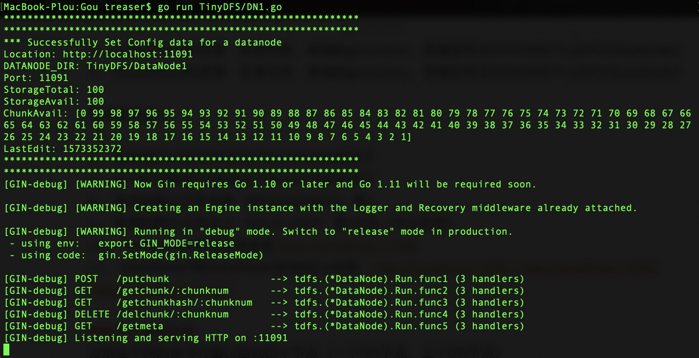

启动命令的输出，从上往下依次是：DN1的元数据打印、gin框架服务器启动：显示了DN1提供服务的路由。

类似地，启动DN2、DN3，Shell的输出是类似的。

然后再启动NN：

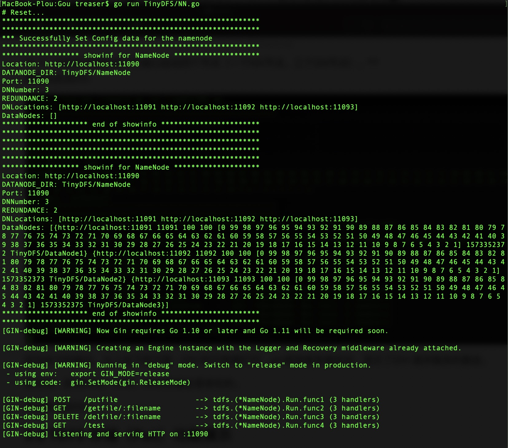

启动命令的输出，从上往下依次是：未向所有DN请求DN元数据前的NN的元数据打印、得到DN元数据后的NN的元数据打印、gin框架服务器启动：显示了NN提供服务的路由。

此时DN1-DN3的shell也有输出，因此NN在启动时会向他们请求元数据：


此时DN1（DN2、DN3类似）下的情况：
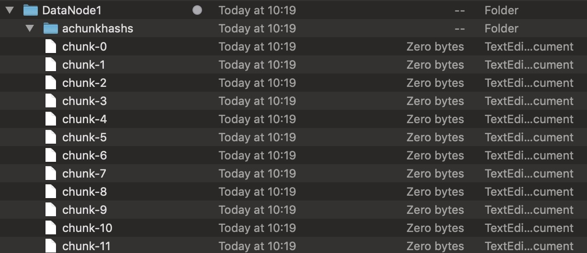

DN1在初始化时创建了100个空的数据块文件。

而此时NN下是空的。

### 3.2 TDFS 存储（Put）功能演示

**1）数据文件准备：**
先准备一些文件来作为测试。

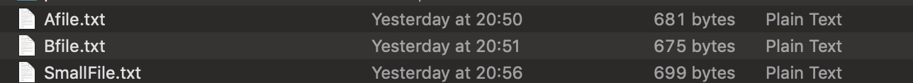

文件都是差不多600多B，因此会被切分为7个块，其中最后一个块是没满的。

AFile.txt和BFile.txt都是一行数据正好等于100B，也就是演示时的块大小的。因此在测试时很容易就看出来文件切分是否正确进行。而AFile.txt、BFile.txt最后一行都不足100B，因此可以验证TDFS对最后一个块的操作是否正确。另外，SmallFile.txt是比较普通的文件。

AFile.txt:
```
AAA FILE: 2019/10/31 17:05:05 demo.go:48: 0 th line of this AAA file. BIG FILE: 2019/10/31 17:05:05.
1th - [ 100 ]byte :01234567890123456789012345678901234567890123456789012345678901234567890123456789
2Th - [ 100 ]byte :01234567890123456789012345678901234567890123456789012345678901234567890123456789
3th - [ 100 ]byte :01234567890123456789012345678901234567890123456789012345678901234567890123456789
4th - [ 100 ]byte :01234567890123456789012345678901234567890123456789012345678901234567890123456789
5th - [ 100 ]byte :01234567890123456789012345678901234567890123456789012345678901234567890123456789
6th - [ 100 ]byte :abcefghijklmnopqrstuvwxyzABCDEFGHIJKLMNOPQRSTUVWXYZ1234567890
```

BFile.txt:
```
BBB FILE: 2019/11/09 17:05:05 demo.go:48: 0 th line of this BBB file. BIG FILE: 2019/11/09 17:05:05.
BBB FILE: 2019/11/09 17:05:05 demo.go:48: 1 th line of this BBB file. BIG FILE: 2019/11/09 17:05:05.
BBB FILE: 2019/11/09 17:05:05 demo.go:48: 2 th line of this BBB file. BIG FILE: 2019/11/09 17:05:05.
BBB FILE: 2019/11/09 17:05:05 demo.go:48: 3 th line of this BBB file. BIG FILE: 2019/11/09 17:05:05.
BBB FILE: 2019/11/09 17:05:05 demo.go:48: 4 th line of this BBB file. BIG FILE: 2019/11/09 17:05:05.
BBB FILE: 2019/11/09 17:05:05 demo.go:48: 5 th line of this BBB file. BIG FILE: 2019/11/09 17:05:05.
BBB FILE: 2019/11/09 17:05:05 demo.go:48: 6 th line of this BBB file.
```

SmallFile.txt:
```
BIG FILE: 2019/10/31 17:05:05 Demo.go:48: 0 th line of this big file.
BIG FILE: 2019/10/31 17:05:05 Demo.go:48: 1 th line of this big file.
BIG FILE: 2019/10/31 17:05:05 Demo.go:48: 2 th line of this big file.
BIG FILE: 2019/10/31 17:05:05 Demo.go:48: 3 th line of this big file.
BIG FILE: 2019/10/31 17:05:05 Demo.go:48: 4 th line of this big file.
BIG FILE: 2019/10/31 17:05:05 Demo.go:48: 5 th line of this big file.
BIG FILE: 2019/10/31 17:05:05 Demo.go:48: 6 th line of this big file.
BIG FILE: 2019/10/31 17:05:05 Demo.go:48: 7 th line of this big file.
BIG FILE: 2019/10/31 17:05:05 Demo.go:48: 8 th line of this big file.
BIG FILE: 2019/10/31 17:05:05 Demo.go:48: 9 th line of this big file.
```

**2）通过Client进行文件存储：**
另外开启一个Shell窗口，键入
```
go run TinyDFS/Client.go -putfile "AFile.txt"
```
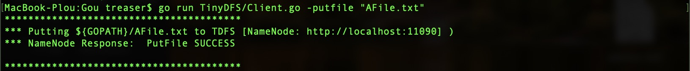

此时NN窗口的Shell输出：
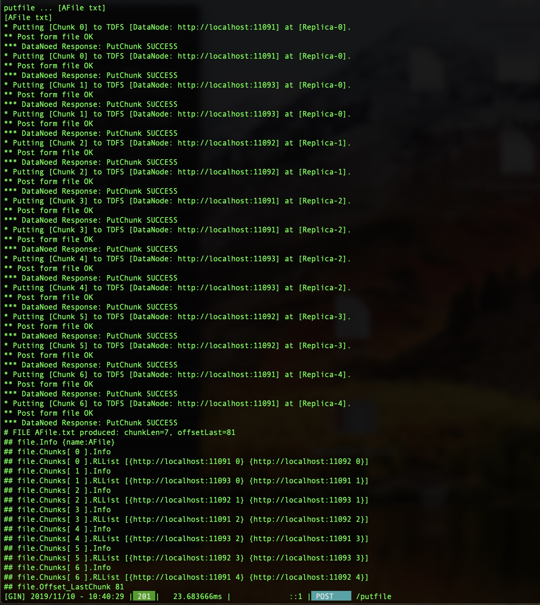

这里Shell输出信息主要说明了两点：一是文件块发给DN是否成功（*后面跟的输出），二是最后这个文件的各个块数据存在哪里（#后面跟的输出）。从这张图可以看出第0个块存在[{http://localhost:11091 0} {http://localhost:11092 0}]，之所以存在两个地方是因为冗余。第1个块存在[{http://localhost:11093 0} {http://localhost:11091 1}]...

此时DN1窗口的Shell输出：
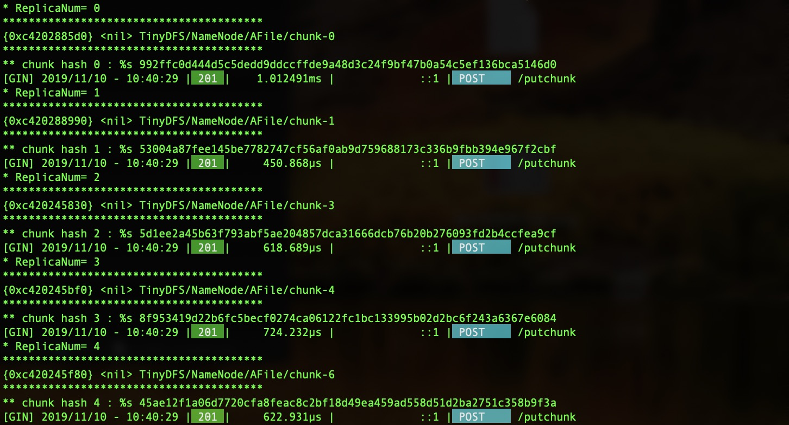

此时DN2窗口的Shell输出：
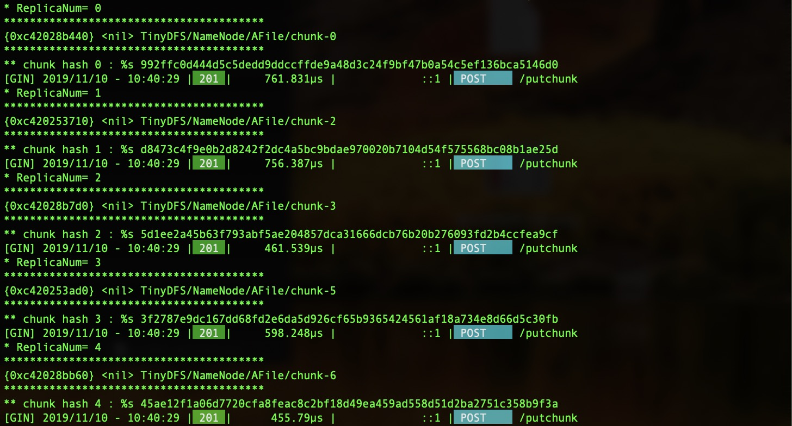

此时DN3窗口的Shell输出：
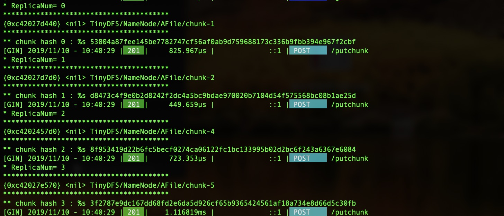


然后可以发现NN工作目录下：

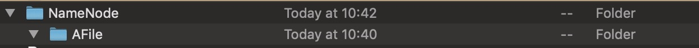
出现了空的AFile目录，并且在DN1中：
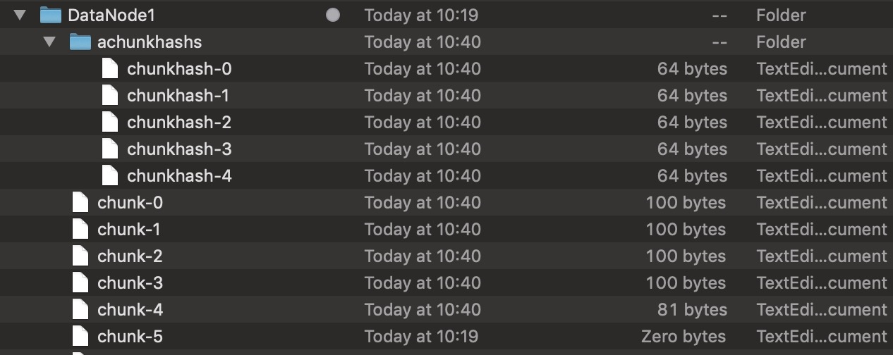
并且在DN2中：
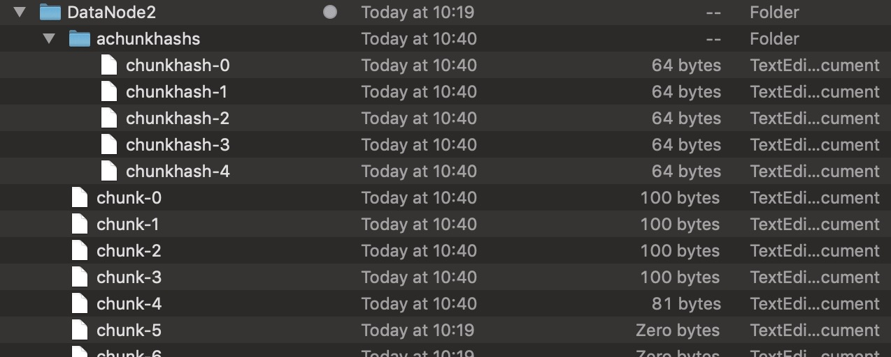
并且在DN3中：
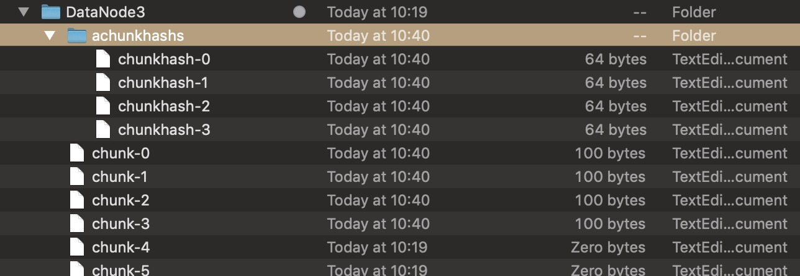

这里81大小的那个块就是文件的最后一个块数据。

以上信息说明，Put成功，文件被TDFS分块存储，并且存储的信息都被记录了。

然后，我们再将其他两个文件也存储到TDFS里：

```shell
go run TinyDFS/Client.go -putfile "BFile.txt"
go run TinyDFS/Client.go -putfile "SmallFile.txt"
```


### 3.3 TDFS 读取（Get）功能演示
在Client的窗口键入：
```
go run TinyDFS/Client.go -getfile "AFile"
```
来从TDFS中读取AFile。

Client的Shell输出

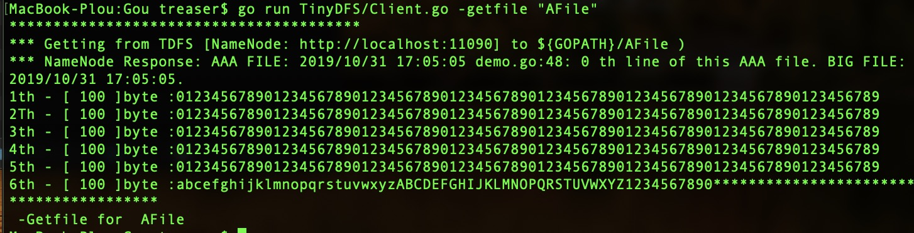

NN的Shell输出
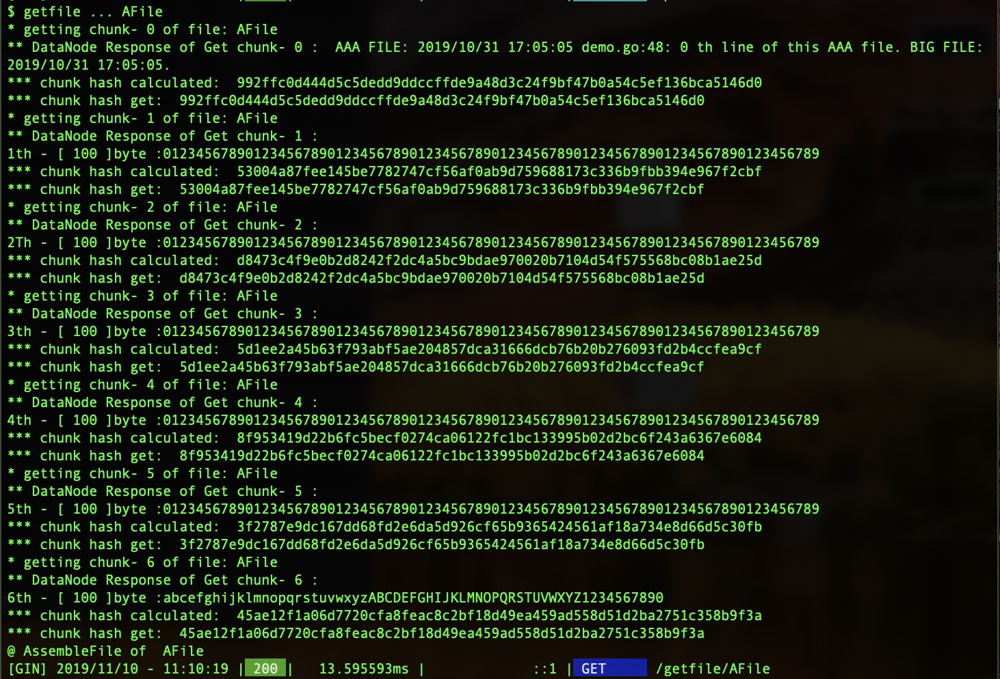

DN1的Shell输出
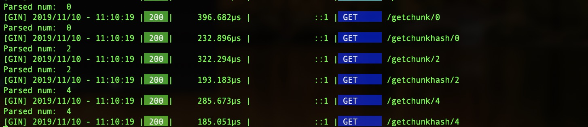

DN2的Shell输出
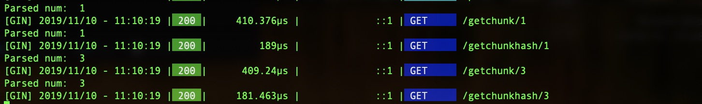

DN3的Shell输出
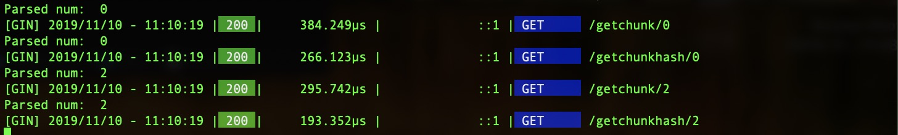

前面我们已经知道AFile的文件块数据是存储:
```
# FILE AFile.txt produced: chunkLen=7, offsetLast=81
## file.Info {name:AFile}
## file.Chunks[ 0 ].Info 
## file.Chunks[ 0 ].RLList [{http://localhost:11091 0} {http://localhost:11092 0}]
## file.Chunks[ 1 ].Info 
## file.Chunks[ 1 ].RLList [{http://localhost:11093 0} {http://localhost:11091 1}]
## file.Chunks[ 2 ].Info 
## file.Chunks[ 2 ].RLList [{http://localhost:11092 1} {http://localhost:11093 1}]
## file.Chunks[ 3 ].Info 
## file.Chunks[ 3 ].RLList [{http://localhost:11091 2} {http://localhost:11092 2}]
## file.Chunks[ 4 ].Info 
## file.Chunks[ 4 ].RLList [{http://localhost:11093 2} {http://localhost:11091 3}]
## file.Chunks[ 5 ].Info 
## file.Chunks[ 5 ].RLList [{http://localhost:11092 3} {http://localhost:11093 3}]
## file.Chunks[ 6 ].Info 
## file.Chunks[ 6 ].RLList [{http://localhost:11091 4} {http://localhost:11092 4}]
## file.Offset_LastChunk 81
```
因此，获取块数据时，如果块数据的第一个副本的数据是对的，就直接返回。通过比对可以发现获取块数据的操作是正确的。

此时在客户端的$GOPATH：
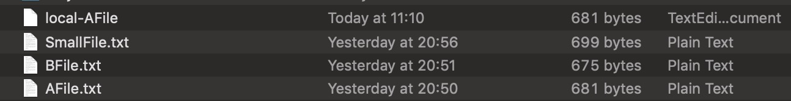
这里的local-AFile就是从TDFS中读取的AFile本地拷贝，虽然文件格式不一样，但是数据内容和AFile一样的。

以及NN的工作目录下：
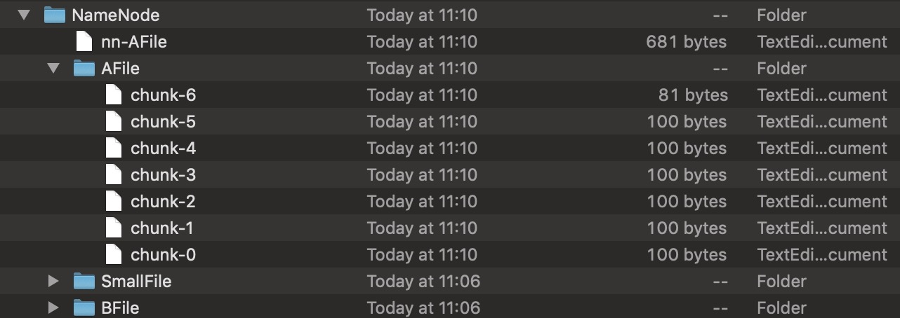

打开Client下的local-AFile（读取文件）和AFile（原文件）、NN下的nn-AFile（NN缓存文件）：

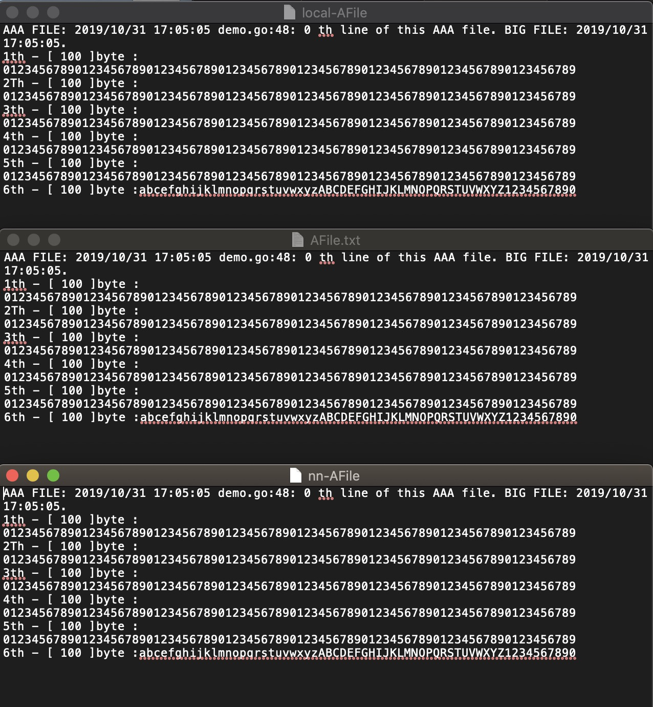

可以发现文件数据是一致的，因此这不仅证明了文件被TDFS有效读取，也被TDFS有效存储，而且也验证了NN的文件缓存功能。

可以获取其他两个文件的数据，验证是否正确与否可以直接看Client下的$GOPATH是否返回了读取的文件以及文件的内容是否正确。或者直接看命令行输出。

```
go run TinyDFS/Client.go -getfile "BFile"
go run TinyDFS/Client.go -getfile "SmallFile"
```
Client的Shell输出：
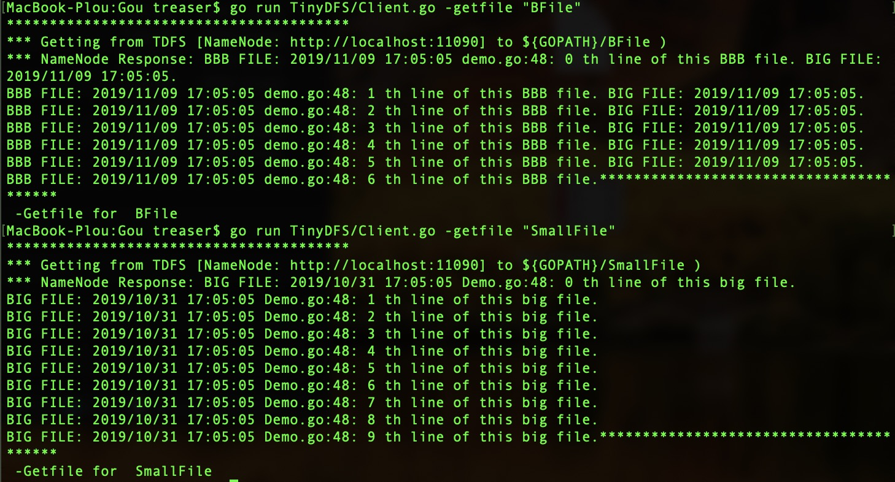

Client的$GOPATH文件：
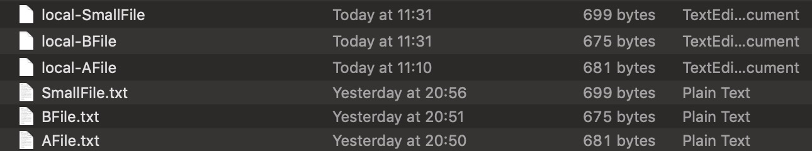

以上也可以证明BFile、SmallFile的读取正确。

### 3.4  TDFS 删除（Delete）功能演示

在Client的窗口键入：
```
go run TinyDFS/Client.go -delfile "AFile"
```
来从TDFS中删除AFile。

Client的Shell输出
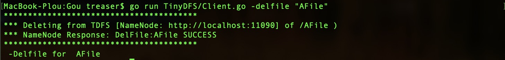

可以看到，因为文件的分块数据是冗余存储的，所以删除时也需要把所有冗余删除。

NN的Shell输出
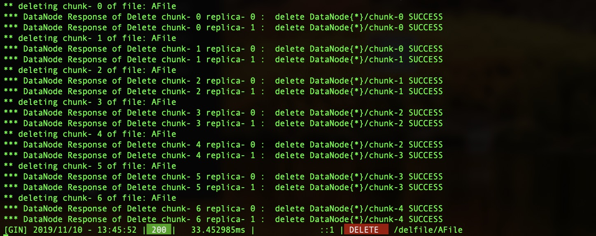

DN1的Shell输出
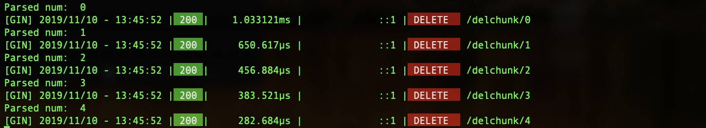

DN2的Shell输出
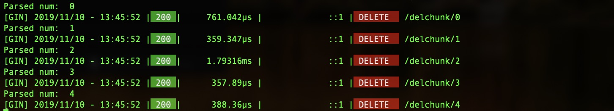

DN3的Shell输出
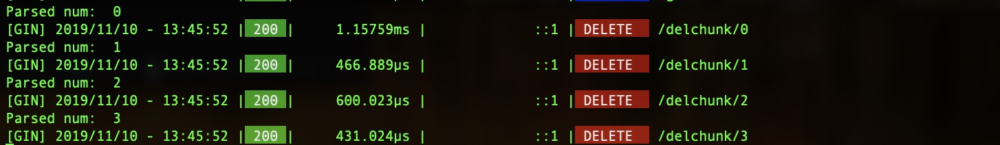

前面我们已经知道AFile的文件块数据的存储位置。

此时在DN1、2、3的工作目录下，DN1目录：:
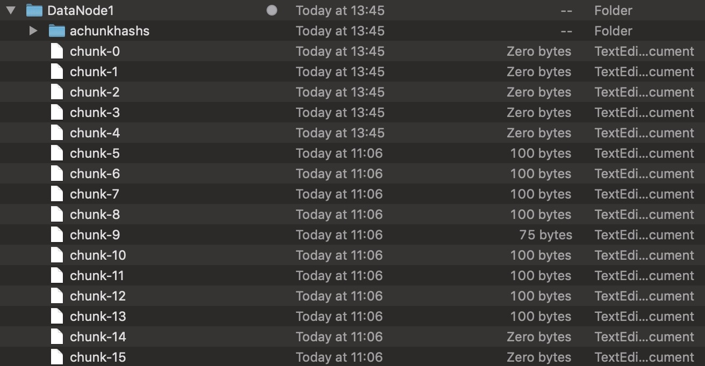
DN2目录：
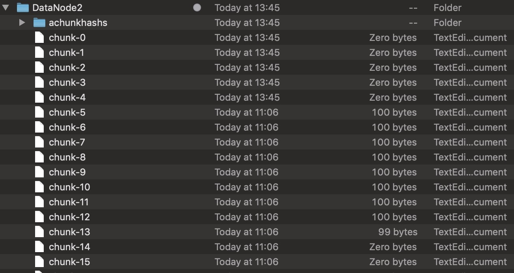
DN3目录：
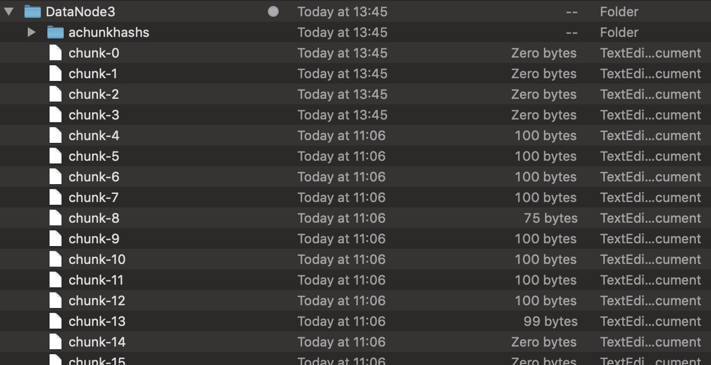

可以看到存储AFile的块数据都被清空了，而BFile、SmallFile的数据还存在。

### 3.5  TDFS 容错演示
经过以上步骤之后，TDFS内存储的文件剩下BFile和SmallFile。接下去我将BFile分块存储在TDFS中的一份副本数据进行故意破坏，看其是否有还能恢复出原来的数据。

根据之前NN的Shell输出：
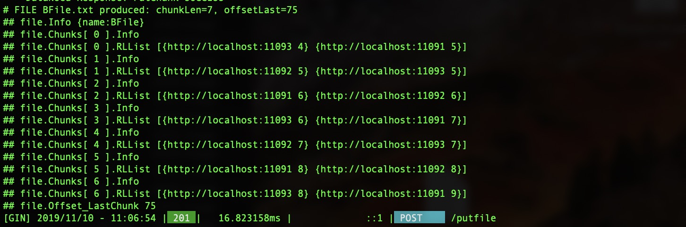

可以得知BFile的第一个块存储在：[{http://localhost:11093 4} {http://localhost:11091 5}]。块是冗余存储的，默认是先从第一个副本（{http://localhost:11093 4}）处读取数据的。所以我们将{http://localhost:11093 4}里的块数据进破坏。http://localhost:11093  是DN3的地址。

DN3的chunk-4在破坏前的数据为：

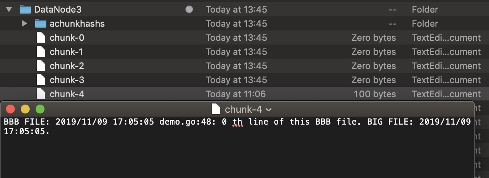

破坏为：
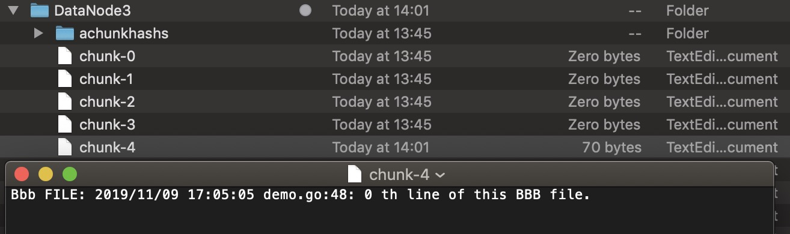

在Client窗口键入：
```
go run TinyDFS/Client.go -getfile "BFile"
```

Client的Shell输出：
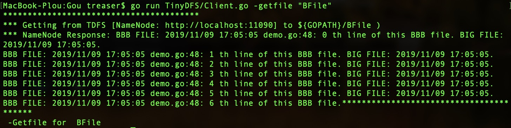

得到的loca-BFile：
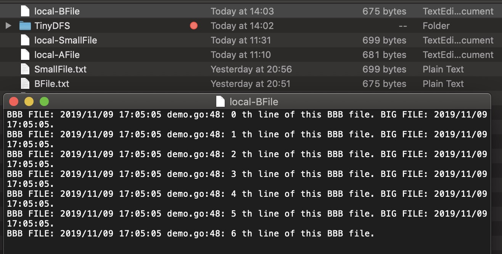

看上去和副本数据没有差错一样。此时查看NN的Shell输出：


在第3行可以看到，第一个块的第一个副本返回的数据确实是"Bbb"开头被我们破坏过的数据。

于是，在第6行可以看到以"X=X"开头的输出信息中，提示了得到的数据的checksum和原数据的checksum不一样，所以向第一个块的第二个副本获取数据。

如果第二个副本的数据也出错了，那就没办法了，出错的数据会返回给客户端。在实际使用中，为了提高容错，可以提高默认冗余系数，我这里为了演示方便只设置了2。

以上，证明了TDFS具有一定的容错能力。

## 4 参考文献

1. [gin框架：用POST进行文件上传](https://elonjelinek.github.io/2018/02/04/gin框架：文件上传/)
2. [客户端上传文件](https://www.jianshu.com/p/3e0c0609d419)
3. [客户端上传文件并附加参数](https://my.oschina.net/solate/blog/741039)